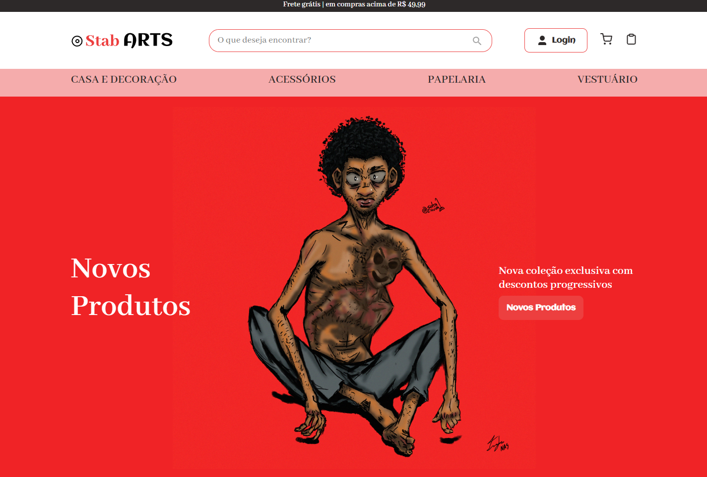

<h4 align="center"> 
    🚧 Projeto em construção 🚧
</h4>

<h1 align="center">
  🛒🎨<br>StabArts | Loja de Arte e Artenasato Online
</h1>



<br>

---
### Instruções para rodar CRUD

abrir a pasta ecommercestabarts no vscode e 
rodar o json server: 
```js
json-server --watch db.json
```

Rodar: browser-sync start --server --file . --host --port 5000 --startPath telas/index.html

---

<a href="https://isaacnreis.github.io/ecommercestabarts/telas
">Acessar GitHub Pages (Somente previw sem conexão total com banco de dados)</a>

---

🖊 Descrição do Projeto: Projeto ilustrativo de um e-commerce, com a venda de produtos de arte e artesanato. Realizado como Challenge do programa ONE da Oracle em parceria com Alura. Com foco primeiramento no desenvovimento Front End, e acresentando funcionalidades para o e-commerce com JavaScript. Utilizando as operações CRUD para manipular o armazenamento dos produtos.

---

### 🎨 Modelo Figma: <a href="https://www.figma.com/file/mOO94q7ZGuq98SCoQl1NN1/E-Commerce---Stab-ARTS?node-id=38208-37&t=FJl081LpWTwQj4nU-0">Link</a>

---

## 👾 Tecnologias utilizadas

- HTML5
- CSS3
- JavaScript
- NodeJS
- Visual Studio Code

---

## 🙋‍♂️👨‍💻 Pessoa Desenvolvedora

| [<br><sub>Isaac N. Reis</sub>](https://github.com/isaacnreis) |
| :---: |

<div> 
  <a href="https://www.instagram.com/isaacacnas/" target="_blank"></a>
  <a href = "mailto:isaacreisn@gmail.com"></a>
  <a href="https://www.linkedin.com/in/isaacnreis/" target="_blank"></a>
  <a href="https://isaacnreis.github.io/portfolio/" target="_blank"></a>

  
</div>

---